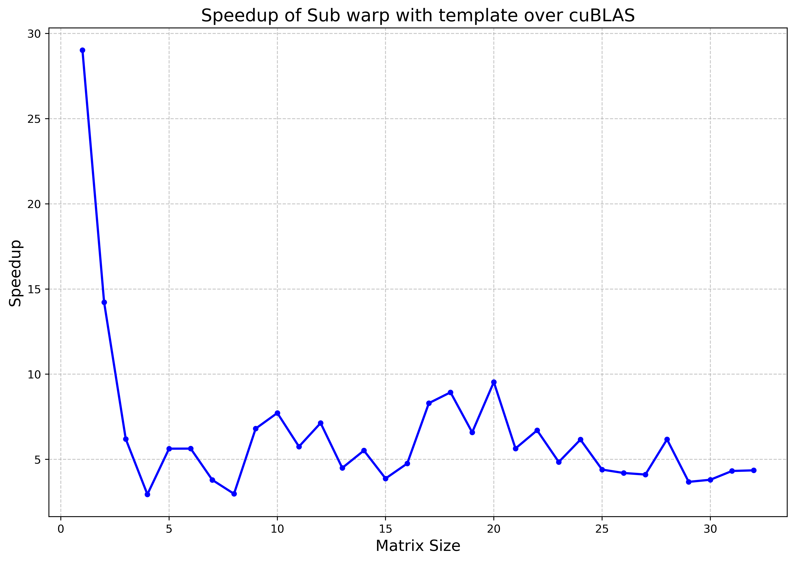
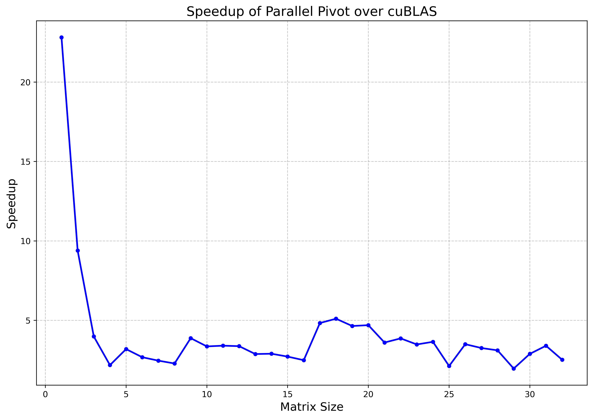

# matrixInversion

## Contents for my Masters thesis "Optimized Block-Level Matrix Inversion Kernels for Small, Batched Matrices on GPUs"

### Abstract

Matrix inversion is one of the computationally challenging and intensive step in numerical
linear algebra. In addition to this, batched matrix inversions, with small matrices pose
a challenge at efficient handling of computational resources. We examine efficient matrix
inversion techniques based on LU decomposition, on GPUs for small batched matrices
of size up-to 32x32, with batch sizes up-to 1,000,000. Techniques for optimal utilization
of memory resources and access patterns as well as sub-warp computation in a single
thread block are demonstrated in the proposed implementation. These proposed implementations
achieve an average speedup of 4x and 6.5x performance speed-up in terms of
runtime compared to cuBLAS, with and without pivoting during the LU decomposition,
using single precision arithmetic on RTX 3080 GPU.

### Speedup

<table>
  <tr>
    <td></td>
    <td></td>
  </tr>
  <tr>
    <td colspan="2" align="center"><b>Speedup over cuBLAS</b></td>
  </tr>
</table>


### Concusion

We presented six different implementations for computing the batched matrix inversion
and benchmark it with cuBLAS. In addition we showed that it is the inversion part of our
implementation that is significantly faster than the corresponding cuBLAS kernel. Our
inversion takes around 10% of the total runtime, whereas the for cuBLAS, the inversion
takes around 66.67% of the total runtime. We achieve a speed up of around 10x for matrix
dimension 20, in case of LU without pivoting, and a speed up of 5x for matrix dimension
18, in case of LU with pivoting. Furthermore, we showed that parallelizing the pivoting
phase of the LU decomposition is crucial for the case of small matrices. Our results also
reflect that the resolution of bank conflicts do not result in gain in performance in terms of
runtime.

### Build Instructions

To compile the CUDA program with optimizations:

```bash

nvcc -O3 -DMATRIXSIZE=32 -DNUMMATRICES=1000 -DNUMTHREADS=32 -g --resource-usage --ptxas-options=-v --expt-relaxed-constexpr --extra-device-vectorization --use_fast_math --default-stream per-thread --std=c++17 --extended-lambda --expt-extended-lambda --Werror cross-execution-space-call --dlink-time-opt --display-error-number --generate-line-info --source-in-ptx -Xcompiler -ffast-math -Xcompiler -march=native -Xcompiler -funroll-loops -Xcompiler -fomit-frame-pointer -Xcompiler -ffunction-sections -Xcompiler -fdata-sections -Xcompiler -fno-stack-protector -Xcompiler -fno-math-errno -Xptxas --opt-level=3 -Xptxas --allow-expensive-optimizations=true -Xptxas -dlcm=cg -Xptxas -dscm=wt -Xptxas --preserve-relocs --restrict -lineinfo -arch=sm_86 -t 0 luBatchedInplace.cu -o custom

```

To profile with NCU:

```bash

ncu --set=full --import-source yes --target-processes all --replay-mode kernel --section InstructionStats --section LaunchStats --section MemoryWorkloadAnalysis --section SchedulerStats --section SourceCounters --section SpeedOfLight --sampling-interval auto --sampling-max-passes 5 --sampling-buffer-size 33554432 --clock-control base --launch-skip 0 --kernel-name-base mangled -f -o profile_output ./custom

```

To compile cuBLAS benchmark:

```bash

nvcc -O3 -lcublas -DMATRIXSIZE=32 -DNUMMATRICES=1000 -DNUMTHREADS=32 -g --resource-usage --ptxas-options=-v --expt-relaxed-constexpr --extra-device-vectorization --use_fast_math --default-stream per-thread --std=c++17 --extended-lambda --expt-extended-lambda --Werror cross-execution-space-call --dlink-time-opt --display-error-number --generate-line-info --source-in-ptx -Xcompiler -ffast-math -Xcompiler -march=native -Xcompiler -funroll-loops -Xcompiler -fomit-frame-pointer -Xcompiler -ffunction-sections -Xcompiler -fdata-sections -Xcompiler -fno-stack-protector -Xcompiler -fno-math-errno -Xptxas --opt-level=3 -Xptxas --allow-expensive-optimizations=true -Xptxas -dlcm=cg -Xptxas -dscm=wt -Xptxas --preserve-relocs --restrict -lineinfo -arch=sm_86 -t 0 benchmark.cu -o benchmark

```

To profile with NCU:

```bash

ncu --set=full --import-source yes --target-processes all --replay-mode kernel --section InstructionStats --section LaunchStats --section MemoryWorkloadAnalysis --section SchedulerStats --section SourceCounters --section SpeedOfLight --sampling-interval auto --sampling-max-passes 5 --sampling-buffer-size 33554432 --clock-control base --launch-skip 0 --kernel-name-base mangled -f -o profile_output ./benchmark

```
